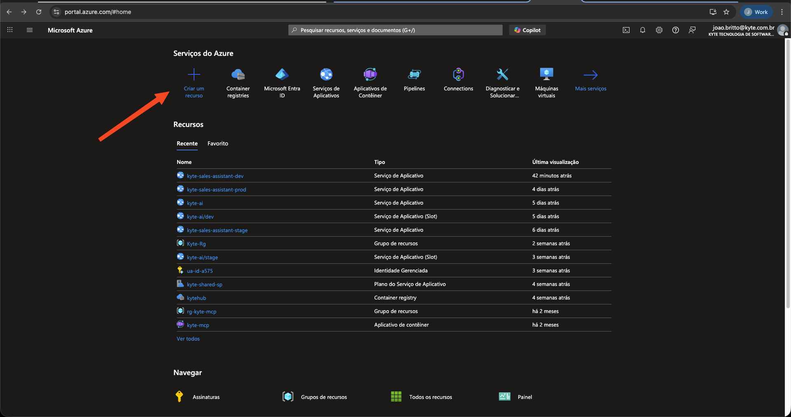
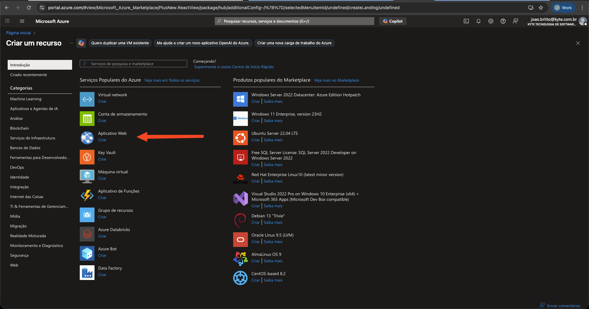
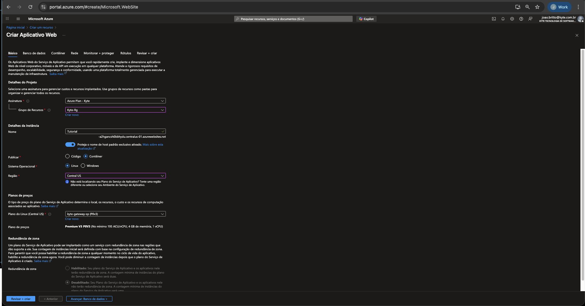
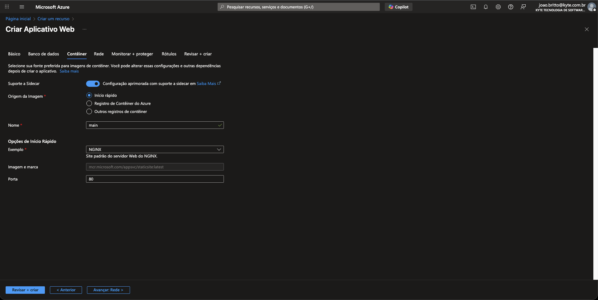

# Tutorial Azure Integration

Aplicação FastAPI minimalista utilizada em um tutorial de deploy contínuo para Azure App Service com imagens Docker hospedadas no GitHub Container Registry (GHCR). Este README descreve todo o fluxo: criação do Web App, preparo do projeto, publicação de imagem, configuração do CI/CD e verificação.

## 1. Pré-requisitos

- Conta Azure com permissão para criar App Services e identidades gerenciadas.
- Docker Desktop ativo localmente.
- Python 3.13 e `uv`/`pip` disponíveis.
- GitHub CLI (`gh`) autenticado na conta que hospeda o repositório.

## 2. Estrutura do projeto

```
.
├── Dockerfile
├── main.py
├── requirements.txt
├── .github/workflows/deploy.yml
├── Fotos/                              # capturas de tela do portal Azure
└── README.md
```

## 3. Configuração inicial no portal Azure

As imagens em `Fotos/` ilustram a sequência usada para criar o Web App `Tutorial`.

1. **Tela inicial do portal**  
     
   Clique em **Criar um recurso**.

2. **Selecionar tipo de recurso**  
     
   Na categoria de serviços populares, escolha **Aplicativo Web**.

3. **Aba Básico (clonei de um webapp ja existente)**  
     
   - Assinatura: selecione seu plano.
   - Grupo de Recursos: `Kyte-Rg`.
   - Nome: `Tutorial`.
   - Publicar: `Container`.
   - Sistema Operacional: `Linux`.
   - Região: `Central US`.
   - Plano: utilize o App Service Plan existente (ex.: `kyte-gateway-sp (Premium V3)`).

4. **Aba Contêiner (quando utilizando ACR)**  
     
   Se estiver usando um Azure Container Registry, selecione-o aqui. No nosso fluxo final usamos GHCR, então apenas referencie esta tela para entender onde ficam os campos de imagem e marcação.

5. **Aba Contêiner (início rápido)**  
     
   Caso opte pela imagem de início rápido (NGINX) apenas para criar o recurso, depois atualizamos a imagem via CLI/CI.

Finalize a criação do recurso clicando em **Revisar + criar**.

## 4. Preparar o ambiente local

```bash
# criar ambiente virtual (opcional)
python3 -m venv .venv
source .venv/bin/activate

# instalar dependências
pip install -r requirements.txt

# validar localmente
uvicorn main:app --reload
# acessar http://127.0.0.1:8000/health -> {"status": "ok"}
```

## 5. Dockerizar e publicar manualmente (opcional)

```bash
# construir imagem local
docker build -t ghcr.io/<seu-usuario>/tutorial_azure_integration:latest .

# login no GHCR (token com write:packages)
echo "$GHCR_TOKEN" | docker login ghcr.io -u <seu-usuario> --password-stdin

# enviar imagem
docker push ghcr.io/<seu-usuario>/tutorial_azure_integration:latest
```

> O pipeline automatiza o build/push, mas os comandos acima são úteis para testes locais.

## 6. Configurações via Azure CLI

```bash
# garantir que a aplicação responda na porta 8000
az webapp config appsettings set \
  -g Kyte-Rg \
  -n Tutorial \
  --settings WEBSITES_PORT=8000

# apontar o App Service para a imagem hospedada no GHCR
az webapp config container set \
  -g Kyte-Rg \
  -n Tutorial \
  --container-image-name ghcr.io/<seu-usuario>/tutorial_azure_integration:latest \
  --container-registry-url https://ghcr.io \
  --container-registry-user <seu-usuario> \
  --container-registry-password $GHCR_TOKEN

# reiniciar o site
az webapp restart -g Kyte-Rg -n Tutorial
```

## 7. Configurar GitHub Actions

O workflow `.github/workflows/deploy.yml` realiza:

1. Checkout e instalação de dependências Python.
2. Teste rápido do endpoint `/health`.
3. Build e push da imagem com tags `latest` e `${{ github.sha }}`.
4. Login no Azure usando um Service Principal.
5. Atualização do App Service para apontar para a nova imagem e reinício da aplicação.

### Segredos necessários

| Segredo | Como obter | Uso |
| --- | --- | --- |
| `GHCR_DEPLOY_TOKEN` | Token do GitHub com `read:packages`/`write:packages`. | Permite que a action configure o App Service com acesso ao GHCR. |
| `AZURE_WEBAPP_PUBLISH_PROFILE` | `az webapp deployment list-publishing-profiles -g Kyte-Rg -n Tutorial --xml` | Necessário para ações que estejam baseadas em publish profile (mantivemos para referência). |
| `AZURE_CREDENTIALS` | Service Principal em formato JSON (`az ad sp create-for-rbac ... --sdk-auth`). | Utilizado pelo `azure/login@v2` durante o deploy via CLI. |

#### Exemplos de comandos

```bash
# gerar publish profile em arquivo temporário
az webapp deployment list-publishing-profiles \
  -g Kyte-Rg \
  -n Tutorial \
  --xml > publish_profile.xml
gh secret set AZURE_WEBAPP_PUBLISH_PROFILE < publish_profile.xml

# criar Service Principal com acesso ao grupo
az ad sp create-for-rbac \
  --name tutorial-azure-integration-gh \
  --role contributor \
  --scopes /subscriptions/<subscription-id>/resourceGroups/Kyte-Rg \
  --sdk-auth > azure_creds.json
gh secret set AZURE_CREDENTIALS < azure_creds.json

# token GHCR
gh secret set GHCR_DEPLOY_TOKEN --body "$GHCR_TOKEN"
```

## 8. Fluxo de deploy automático

1. Commit + push na branch `main`.
2. GitHub Actions cria a imagem e publica no GHCR.
3. Action autentica no Azure com o Service Principal.
4. CLI atualiza a imagem configurada no App Service e reinicia a aplicação.
5. Validar com:

```bash
curl https://tutorial-a2hgancsh0bbhydu.centralus-01.azurewebsites.net/health
# retorno esperado: {"status":"ok"}
```

## 9. Boas práticas adicionais

- Revogue/rotacione tokens (`GHCR_TOKEN`, Service Principal) periodicamente.
- Monitore o log do App Service via `az webapp log tail -g Kyte-Rg -n Tutorial`.
- Ajuste a porta do contêiner se a aplicação evoluir para múltiplos serviços.

## 10. Referências

- [FastAPI](https://fastapi.tiangolo.com/)
- [Azure App Service - Contêineres Linux](https://learn.microsoft.com/azure/app-service/)
- [GitHub Actions para Azure](https://learn.microsoft.com/azure/app-service/deploy-github-actions)
